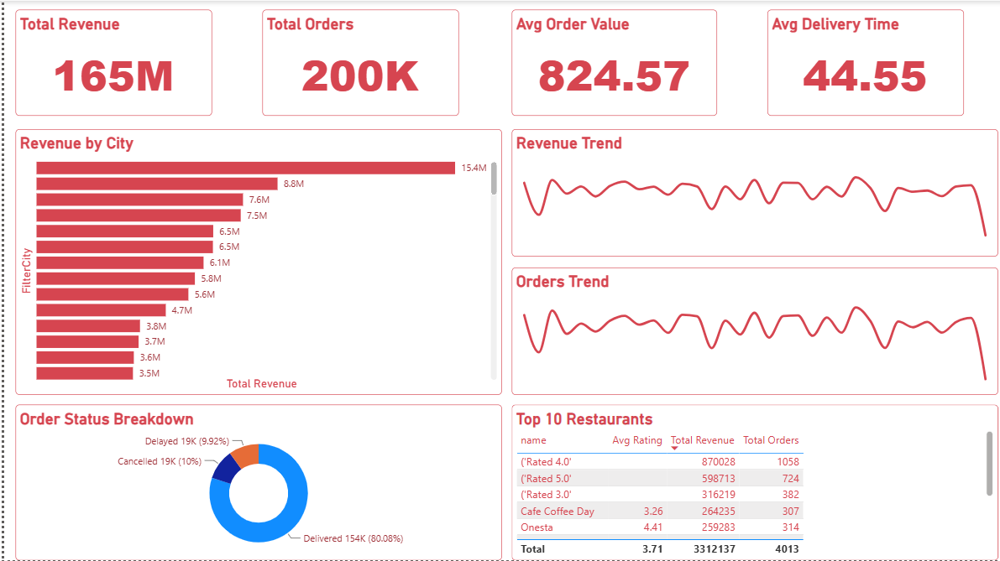
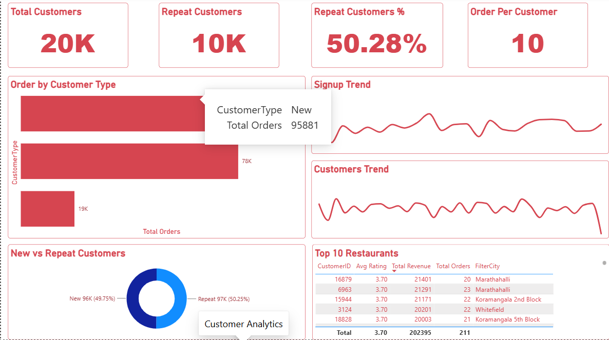
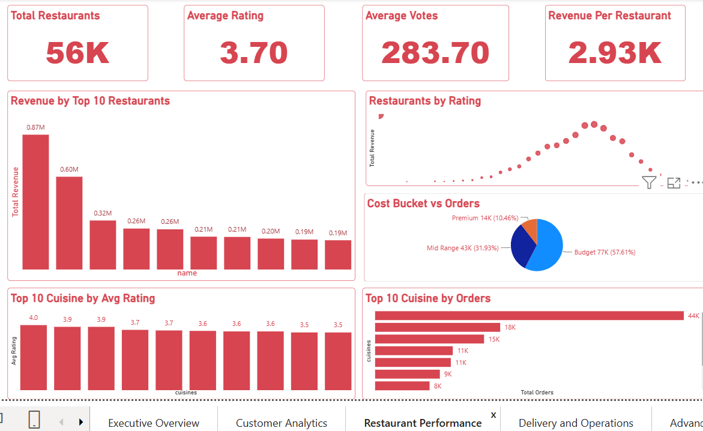
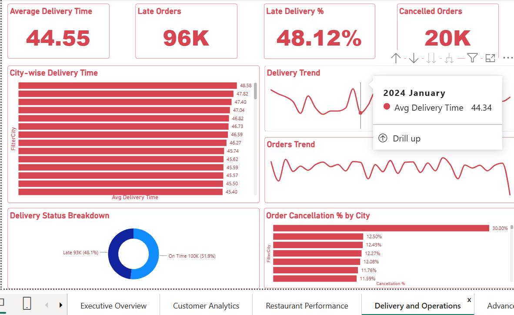

# 🍽️ Restaurant Analytics Dashboard

An interactive Business Intelligence dashboard built using **Power BI**, **Power Query**, and **DAX** to analyze restaurant performance, customer behavior, revenue trends, and delivery operations. The dashboard provides stakeholders with actionable insights through KPI tracking, advanced filtering, drill-through analysis, and interactive visualizations.

---

## 📊 Project Overview

This project analyzes food delivery and restaurant data to uncover insights related to:

- Revenue performance and growth trends
- Customer ordering behavior and retention
- Restaurant ratings and popularity
- Delivery efficiency and operational performance
- Order cancellations and delays
- City-wise and cuisine-wise business performance

The dashboard enables users to explore business metrics at multiple levels, from executive summaries to detailed restaurant-level analysis.

---

## 🎯 Business Objectives

- Monitor key business KPIs in real time.
- Analyze customer retention and repeat purchasing behavior.
- Identify top-performing restaurants and cuisines.
- Evaluate delivery efficiency and operational bottlenecks.
- Track revenue and order growth over time.
- Support data-driven decision-making through interactive reporting.

---

## 🛠️ Tools & Technologies

- Power BI Desktop
- Power Query
- DAX (Data Analysis Expressions)
- Data Modeling
- Interactive Visualizations

---

## 📂 Dashboard Pages

### 1. Executive Overview

Provides a high-level summary of overall business performance.

**KPIs**
- Total Revenue
- Total Orders
- Average Order Value (AOV)
- Average Delivery Time
- Total Customers
- Total Restaurants

**Analysis**
- Revenue trends
- Order trends
- City-wise performance overview
- Revenue distribution

---

### 2. Customer Analytics

Analyzes customer behavior and retention.

**KPIs**
- Total Customers
- Repeat Customers
- Repeat Customer %
- Orders Per Customer

**Analysis**
- Customer ordering patterns
- Repeat customer behavior
- Revenue contribution by customer groups
- Retention insights

---

### 3. Restaurant Performance

Evaluates restaurant-level performance.

**KPIs**
- Revenue per Restaurant
- Average Rating
- Average Votes

**Analysis**
- Top-performing restaurants
- Restaurant rating distribution
- Cuisine analysis
- Revenue contribution by restaurant

---

### 4. Delivery & Operations

Monitors operational efficiency and order fulfillment.

**KPIs**
- Delivered Orders
- Cancelled Orders
- Cancellation %
- Late Orders
- Late Delivery %

**Analysis**
- Delivery performance monitoring
- Order status tracking
- Operational bottlenecks
- Delivery efficiency insights

---

## 🔍 Interactive Features

### Advanced Filtering
The dashboard includes interactive slicers for:

- City
- Restaurant
- Cuisine
- Rating Category
- Cost Category
- Date

### Drill-Through Analysis
Implemented restaurant-level drill-through functionality, allowing users to navigate from summary reports to detailed restaurant performance views.

### Cross-Filtering
All visuals interact dynamically to provide contextual insights and deeper analysis.

---

## 🧹 Data Preparation

Data preprocessing was performed using **Power Query**.

### Cleaning & Transformation

- Trimmed and cleaned text fields.
- Corrected data types.
- Handled missing values.
- Validated city information.
- Removed invalid entries from reporting views.
- Created derived categorical fields for business analysis.

---

## 📈 Data Modeling & Feature Engineering

### Customer Table

**FilterCity**
- Filters invalid or inconsistent city values used in reporting.

### Restaurant Table

**Cost Bucket**
- Budget
- Mid Range
- Premium

**Rating Bucket**
- Excellent
- Good
- Average
- Low

### Orders Table

**Delivery Status**
- On Time
- Late

**Order Month**
- Monthly time-based analysis and reporting.

---

## 📊 DAX Measures

### Revenue Metrics
- Total Revenue
- Revenue YTD
- Revenue Previous Month
- Revenue Growth %

### Order Metrics
- Total Orders
- Orders YTD
- Delivered Orders
- Cancelled Orders

### Customer Metrics
- Total Customers
- Repeat Customers
- Repeat Customer %
- Orders Per Customer

### Delivery Metrics
- Average Delivery Time
- Late Orders
- Late Delivery %

### Restaurant Metrics
- Total Restaurants
- Revenue per Restaurant
- Average Rating
- Average Votes

---

## 📌 Key Insights Generated

- Revenue trends across different time periods.
- Customer retention and repeat ordering behavior.
- High-performing restaurants and cuisines.
- Delivery efficiency and operational performance.
- Cancellation and late-delivery analysis.
- Geographic performance comparisons.
- Restaurant-level performance evaluation.

---

## 📷 Dashboard Preview

### Executive Overview

### Customer Analytics

### Restaurant Performance

### Delivery & Operations

---

## 🚀 Future Enhancements

- RFM Customer Segmentation
- KPI Scorecard Dashboard
- Business Recommendations Page
- Revenue Forecasting
- Cohort Analysis
- Advanced KPI Benchmarking

---

## 📈 Business Impact

This dashboard helps stakeholders:

- Monitor platform performance effectively.
- Identify revenue-driving restaurants and cuisines.
- Improve customer retention strategies.
- Reduce delivery inefficiencies.
- Track operational KPIs.
- Make informed business decisions using data-driven insights.

---

## 👨‍💻 Author

**Som Deo Singh**
